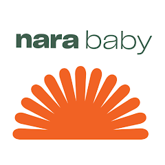

# Nara Baby Integration for Home Assistant

A fully-featured, real-time custom component for integrating the [Nara Baby](https://narababy.com/) tracker into Home Assistant. 

  

## Features

- **Real-Time Streaming**: Syncs instantly using Server-Sent Events (SSE). No polling delays!
- **Comprehensive Sensors**: Tracks 1-day, 7-day, and 14-day trends for sleep, feeding (breast & bottle), pumping, and diapers.
- **"Time Since" Analytics**: Real-time timestamp sensors for `Last Feed`, `Last Diaper`, and `Wake Window Start`.
- **Day vs. Night Sleep**: Automatically separates daytime naps from nighttime sleep in your trends.
- **Calendar Integration**: Beautifully plots all your Nara activities directly into a Home Assistant calendar entity.
- **Dynamic Timers**: Control active feed, pump, and sleep sessions directly from your HA dashboards using standard Home Assistant Switches and Buttons.
- **Logging Services**: Log new diapers, sleep sessions, feeds, solids, growth measurements, and milestones natively from HA automations.

## Installation

### Method 1: HACS (Recommended)
1. Open HACS in Home Assistant.
2. Click on the 3 dots in the top right corner and select **Custom repositories**.
3. Add this repository's URL and select the category as **Integration**.
4. Click **Install** on the Nara Baby integration and restart Home Assistant.
5. Go to **Settings > Devices & Services > Add Integration** and search for "Nara Baby".

### Method 2: Manual
1. Download this repository.
2. Copy the `custom_components/nara` folder into your Home Assistant `config/custom_components` directory.
3. Restart Home Assistant.
4. Go to **Settings > Devices & Services > Add Integration** and search for "Nara Baby".

## Configuration

When adding the integration via the UI, you will be prompted to enter your Nara Baby account email and password. These credentials are used to authenticate securely with the Nara API to fetch your data.

## Actions & Services

You can use the following services in your automations, scripts, or dashboards:
- `nara.log_diaper`
- `nara.log_sleep`
- `nara.log_bottle_feed`
- `nara.log_breast_feed`
- `nara.log_solid_feed`
- `nara.log_growth`
- `nara.log_health`
- `nara.log_milestone`

## Active Timers

The integration dynamically monitors your active sessions. When you start a feed, pump, or sleep session (either via the Nara App or Home Assistant), the integration instantly generates HA entities to control them:

- **Toggle Switches**: E.g., `switch.nara_feed_left`, `switch.nara_pump_right`, `switch.nara_sleep`. Toggling these pauses and resumes the specific session.
- **Finish Buttons**: E.g., `button.nara_finish_feed`. Pressing this completely stops the timer and finalizes the session.

---

*Disclaimer: This is a community-built integration and is not officially affiliated with Nara Organics.*
